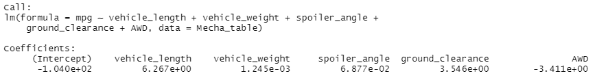
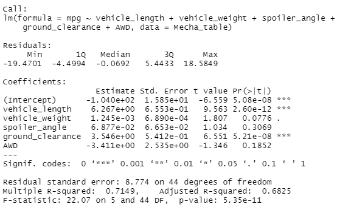
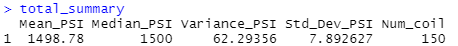
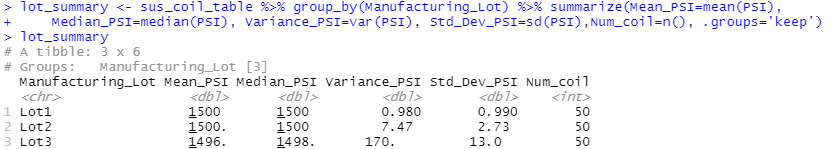
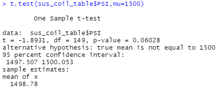
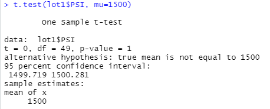
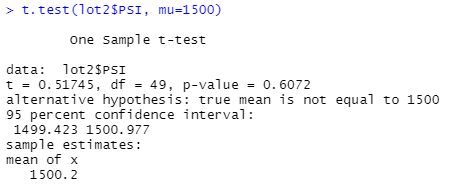
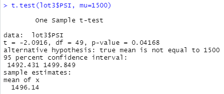

# MechaCar_Statistical_Analysis using R 

## Linear Regression to Predict MPG
- Columns: vehicle_length, vehicle_weight, spoiler_angle, ground_clearance, and AWD

#### By the screenshot of the output from the linear regression:
- Which variables/coefficients provided a non-random amount of variance to the mpg values in the dataset?
  - Vehicle length and ground clearance are statistically unlikely to provide random amounts of variance to the linear model, 
      in other words, Vehicle length and Ground clearance have a significant impact on the MPG. 
- Is the slope of the linear model considered to be zero? Why or why not?
  - No, the slope of this linear model is not considered to be zero. Based on the result, r-squared value is 0.71 and p-value is 5.35e-11 ,
       which can tell us that roughly 70% of the variablity of our dependent variable(MPG) is explained using this linear model and
       p-value being much smaller than our significance level of 0.05% can lead us to state that there is sufficient evidence to reject our null hypothesis
       which means that the slope of our linear model is not zero. 
- Does this linear model predict mpg of MechaCar prototypes effectively? Why or why not?
  - Yes, this muliple linear regression model predicts the MPG of MechaCar prototypes effectively because the r-squared value is 0.71 which
     can tell us that probability metric to determine the likelihood that the future data points will fit this linear model. 
  
## Summary Statistics on Suspension Coils
- total_summary dataframe

- lot_summary dataframe

  - The variance of the coils is 62.29 PSI(pounds per square inch) that is within 100 PSI, which tells us that the current manufacturing lots in total
     meets the requirement easily. 
  - However, if we think of each lot individually, the situation becomes different. Lot1 and Lot 2 are well within the 100 PSI but Lot3 has much bigger variance(170).

## T-Tests on Suspension Coils

#### Summary of the t-test results across all manufacturing lots

  - Assuming our significance level is 0.05 percent, our p-value 0.06 is above our significance level. 
  - Therefore, we do not have sufficient evidence to reject the null hyphothesis and we would state that the mean of all 3 manufacturing lots 
      is statistically similar to the presumed population mean of 1500. 

#### Summary of the t-test results for individual manufacturing lots

  - 1. Lot 1 sample actually has true sample mean of 1500, and with p-value of 1, we cannot reject the null hypothesis and 
      there is no statistical difference between observed sample mean and the presumed population mean of 1500. 
  - 2. Lot 2 sample has p-value of 0.6072 which is way above our significance level of 0.05 percent. 
       Therefore we do not have sufficient evidence to reject the null hyphothesis and we can state that the mean from the presumed population and
       the observed sample are similar
  - 3. Lot 3 sample has p-value of 0.0417 which is below our significance level of 0.05 percent.
       Therefore we have sufficient evidence to reject the null hypothesis and we can state that the observed sample mean and the presumed poluation mean of 1500
       are statistically different. 

- What this tells us is that Lot 3 has to be looked at and checked. 

## Study Design: MechaCar vs Competition
